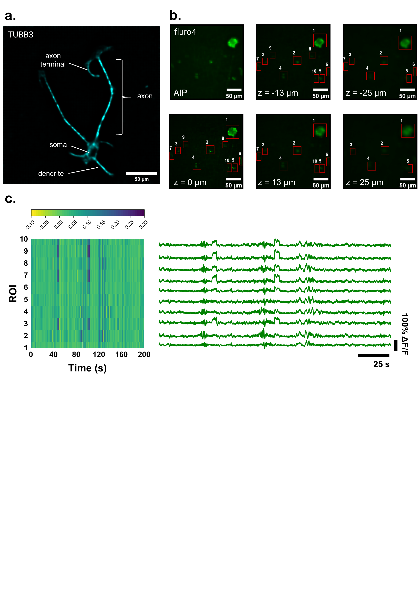
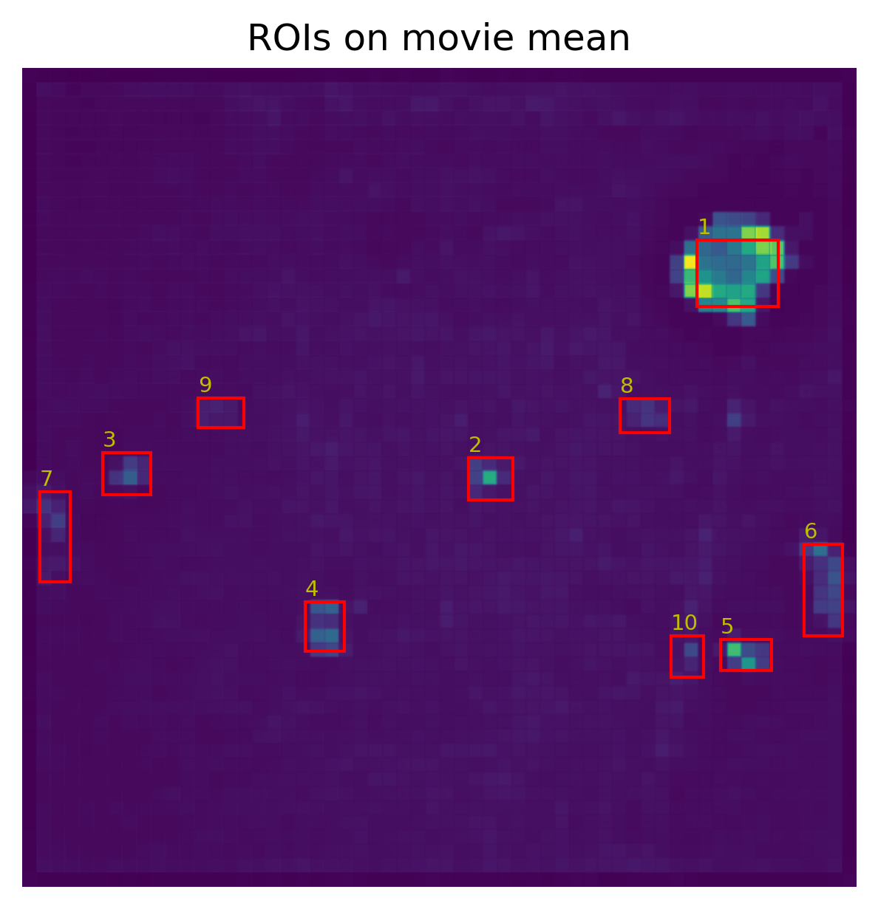
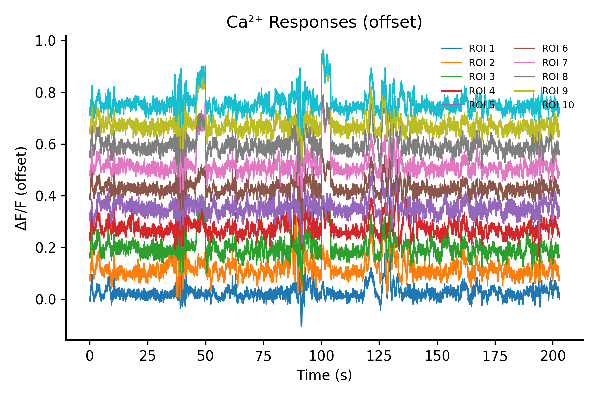
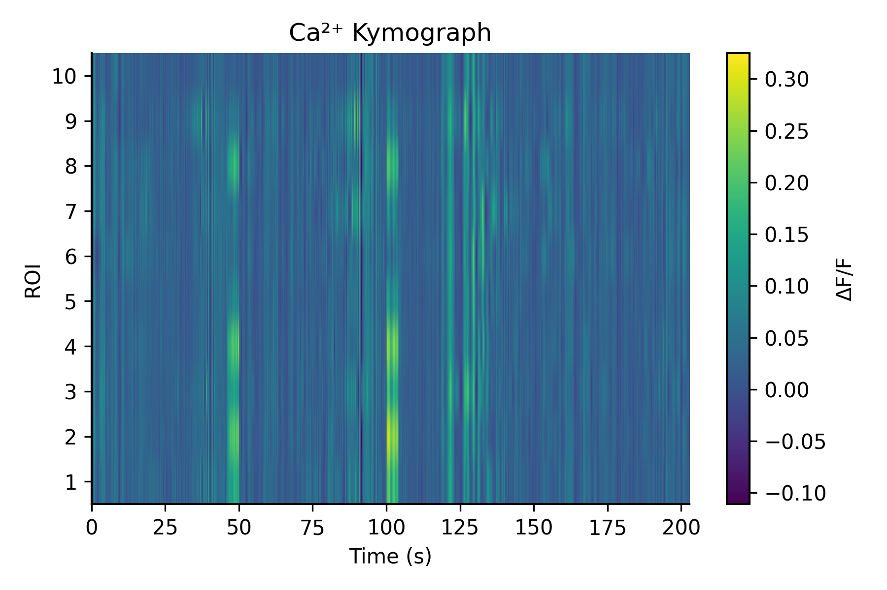

# 🧠 High-Speed Volumetric Ca²⁺ Imaging Analysis Pipeline  
### ROI-based calcium dynamics extraction, ΔF/F computation, and event quantification

---

## 📌 Overview

This repository provides a **complete, end-to-end pipeline** for analyzing volumetric calcium imaging data.

It enables:

- 🎯 Interactive ROI selection (on projection image)
- 🔄 Automatic ROI mapping to movie space
- 📈 Robust ΔF/F signal extraction
- ⚡ Adaptive Ca²⁺ peak detection
- 🌐 Network-level visualization (kymograph, traces)
- 💾 Export of publication-ready figures and structured datasets

> Designed for **high-speed volumetric imaging** (light-field, 2P, LSFM, etc.)

---

## 🧪 Example Outputs

### 🔴 ROI Selection and Mapping

#### ROIs drawn on projection image



### 📈 Calcium Activity

#### ΔF/F traces with detected peaks


#### Kymograph



### 🧬 Biological Example

#### Volumetric Ca²⁺ imaging dataset


---

## 🧠 Biological Context

This pipeline was developed for **high-speed volumetric calcium imaging of neuronal cultures**, enabling:

- Single-cell activity extraction across depth
- Detection of:
  - Synchronous events
  - Heterogeneous network dynamics
- Quantification of:
  - Ca²⁺ event frequency
  - Peak amplitude
  - Temporal coordination

---

## ⚙️ Pipeline Architecture

### 1. Data Input

Supports:
- `.jpg / .png` → ROI selection
- `.tif / .tiff` → volumetric stacks
- `.avi` → movies

---

### 2. ROI Selection

- Interactive box drawing
- Press `Enter` to finalize

---

### 3. ROI Mapping

Automatically rescales ROIs from image → movie resolution

---

### 4. Signal Extraction

Mean fluorescence per ROI across time:

ROI(t) = mean intensity within ROI

---

### 5. ΔF/F Computation (Robust)

Baseline estimated using rolling percentile:

ΔF/F = (F - F₀) / F₀


- Resistant to drift and bleaching
- No manual baseline tuning required

---

### 6. Peak Detection

- Bandpass filtering
- MAD-based adaptive threshold
- Outputs:
  - Number of peaks
  - Mean amplitude
  - Event frequency

---

### 7. Visualization

- ROI overlays
- Traces + peaks
- Offset traces
- Kymograph

---

### 8. Data Export

Outputs:

| File | Description |
|------|------------|
| `*_rois_on_image.csv` | ROI definitions (image space) |
| `*_rois_on_movie.csv` | ROI definitions (movie space) |
| `*_roi_traces_raw.csv` | Raw intensity traces |
| `*_roi_traces_dff.csv` | ΔF/F traces |
| `*_metrics.csv` | ROI-level summary |
| `*_peaks_events_long.csv` | Peak-level dataset |

---

## 🚀 Usage

### 1. Install dependencies

```bash
pip install numpy matplotlib pillow imageio pandas scipy

2. Run pipeline
python processing_image_cortical.py
3. Configure paths
roi_image_path = "combine.jpg"
movie_path = "combine.tif"
fps = 20
4. Draw ROIs
Drag boxes
Press Enter
5. Output

Results saved in:

meta-lfm-cortical_outputs/
📁 Project Structure
.
├── processing_image_cortical.py
├── fig/
│   ├── roi_on_image.png
│   ├── roi_on_movie.png
│   ├── traces_peaks.png
│   ├── offset_traces.png
│   ├── kymograph.png
│   └── biological_example.png
├── data/
│   ├── combine.jpg
│   ├── combine.tif
├── outputs/
└── README.md
📈 Key Features
🔹 Robust ΔF/F
Percentile-based baseline
Handles noise + bleaching
🔹 Adaptive Peak Detection
Data-driven threshold (MAD)
No manual tuning
🔹 Cross-resolution ROI Mapping
Works with mismatched image/movie sizes
🔹 Publication-ready Outputs
Clean figures
Structured datasets
🧠 Interpretation Guide
ΔF/F Traces
Individual neuron activity
Peaks
Calcium events
Frequency → activity level
Kymograph
Vertical bands → synchronized activity
Sparse signals → heterogeneous network
Offset Plot
Temporal alignment across neurons
🧬 Applications
Primary neuron cultures
Drug screening
Network dynamics analysis
Volumetric imaging pipelines

🧾 Citation
Author et al.
High-speed volumetric calcium imaging analysis pipeline
GitHub repository, 2026
🤝 Contribution

PRs welcome for:

GPU acceleration
Batch processing
GUI improvements
Network-level analytics
🧠 Final Note

This repository is structured as:

A reusable analysis framework for volumetric calcium imaging

Not just a script — but a method-ready platform for:

Papers
Supplementary data
Reproducible neuroscience

---

## 🚨 Important (you must do this)

Create a `fig/` folder in your repo and name images exactly:


fig/
├── roi_on_image.png
├── roi_on_movie.png
├── traces_peaks.png
├── offset_traces.png
├── kymograph.png
├── biological_example.png